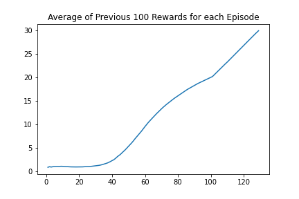
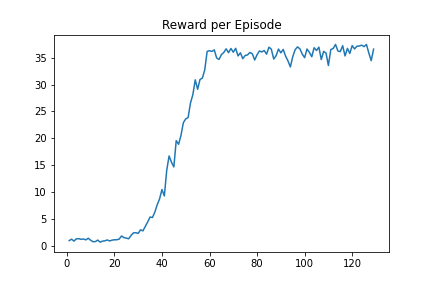

This project uses the Deep Deterministic Policy Gradient (DDPG) reinforcement learning algorithm to solve a robotic arm environment.

# Action Space
There are 4 action dimensions per timestep.  The robotic hand has 2 joints.  Since torque is calculated with 2 numbers (Force and Direction), the agent requires 4 numbers on every timestep to make up the 2 torques for both joints.  Each action dimension is restricted uniformly in the range -1 to 1 inclusive.

# State Space
There are 33 state dimensions per timestep corresponding to data such as position, rotation, and angular velocity of parts of the robotic arm.  These dimensions are all continuous variables.

# Reward Structure
The agent receives a reward of +0.1 every timestep where the tip of its arm (the 'hand') is inside a moving 3D sphere that hovers around the agents anchor point randomly.  If the tip of the arm is not inside the 3D sphere, a reward of 0 is given.

# Goal
Achieve an average of average scores for all 20 interacting agents in the environment over the past 100 episodes of 30+.

# Network Architectures

Actor Network Architecture: 
Input (33 State Dimensions) 
BatchNorm1d 
Linear 100 Neurons 
BatchNorm1d 
Relu 
Linear 200 Neurons 
BatchNorm1d 
Relu 
Linear 100 Neurons 
BatchNorm1d 
Relu 
Linear 4 Neurons 
Tanh 
Output (4 Action Dimensions) 

Critic Network Architecture: 
State Input (33 State Dimensions) 
Linear 200 Neurons 
Relu 
Linear 100 Neurons + 4 New Inputs (4 Action Dimensions) 
Relu 
Linear 50 Neurons 
Relu 
Linear 1 Neuron 
Output (1 State-Action Pair Value) 

# Hyperparameters:
There is a single learning agent that collects data from 20 separate instances of the robotic arm all interacting at the same time. In this way data can be gathered quicker and the agent will learn faster. 
Replay Buffer Size = 100,000 
Batch Size = 128 
Timesteps between Learning Sessions = 4 
Batch Samples per Learning Session = 1 
Gamma = 0.99 
Tau = 0.001 
Actor Learning Rate = 0.005 
Critic Learning Rate = 0.0005 
L2 Weight Decay = 0 
OU Noise Mean = 0 
OU Noise Theta = 0.15 
OU Noise Standard Deviation = 0.2 
Non-Last Neural Network Hidden Layer Initialization = uniform between -1/sqrt(layer_size) and 1/sqrt(layer_size)
Last Hidden Layer Initialization = uniform between -0.003 and 0.003

# Results
The implementation solved the environment on episode 128 with an average of averages over the past 100 exceeding 30.  Below are 2 graphs showing the average of averages over the past 100 episodes (1st graph) and just the average of the 20 agents each episode (2nd graph).  The algorithm is very quick to pick up at about the 35-40 episode mark.  Code was put in to stop the training when the agent solved the environment, but the graph indicates a higher average score was possible if training had continued.  The final gif shows the trained agent controlling 20 different robotic arms all interacting with the environment.  All are able to keep their hands within the 3D spheres consistently.

# Possible Next Steps

* There are several algorithms that have been shown to outperform DDPG in many situations.  These include Proximal Policy Optimization (PPO), Twin Delayed Deep Deterministic Policy Gradient (TD3), and Soft Actor-Critic (SAC).  Comparing the performance of these algorithms on this task would be interesting.
* Tweak the hyperparameters and network sizes to see if I can get the agent to learn faster and/or use less computing power.
* Implement prioritized experience replay.
